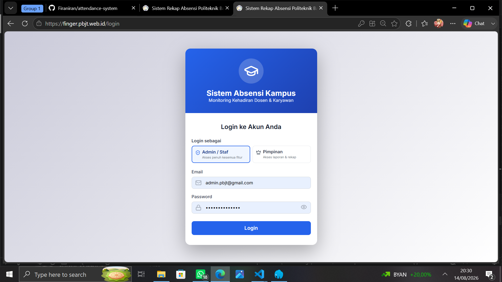
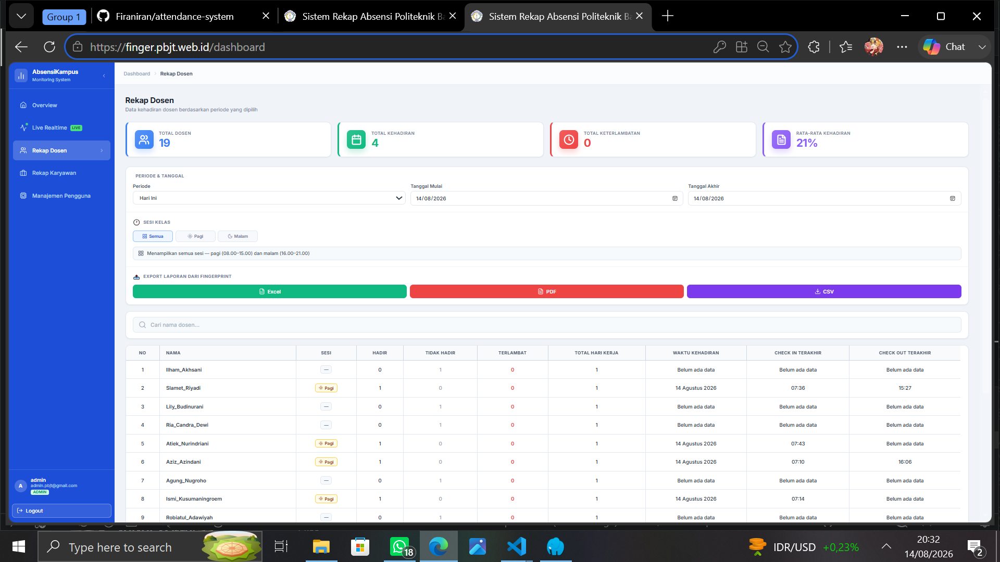
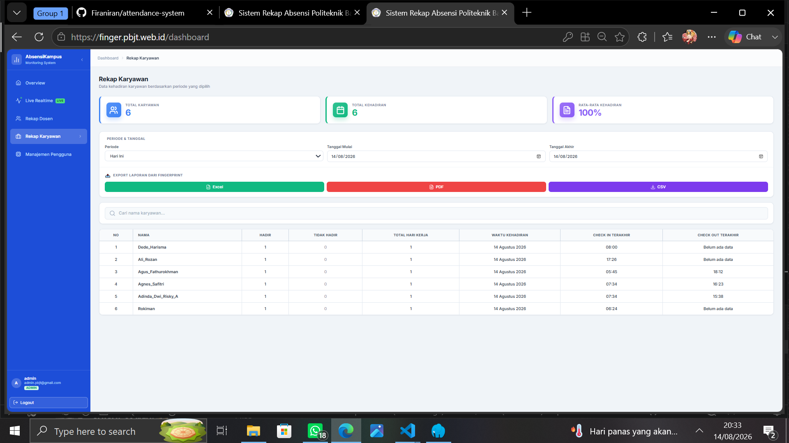

# Sistem Rekap Absensi Kampus

Aplikasi web untuk mengelola dan memantau data kehadiran dosen dan karyawan. Sistem ini terhubung dengan data absensi dari mesin fingerprint dan menyediakan rekap serta pemantauan kehadiran melalui dashboard.

## Fitur

### Login dan Pengguna

* Login menggunakan email dan password
* Reset password menggunakan kode verifikasi melalui email
* Autentikasi menggunakan JWT
* Halaman yang hanya dapat diakses oleh pengguna yang sudah login

### Dashboard

* Rekap absensi dosen
* Rekap absensi karyawan
* Pemantauan kehadiran secara real-time
* Informasi jam keterlambatan karyawan
* Filter berdasarkan minggu, bulan, atau periode tertentu
* Pencarian data
* Statistik kehadiran
* Export data ke Excel, PDF, dan CSV

## Teknologi yang Digunakan

### Frontend

* React.js
* React Router DOM
* Lucide React
* CSS

### Backend

* REST API
* JWT Authentication
* Fetch API

## Struktur Project

```text
attendance-system/
├── public/
├── src/
│   ├── components/
│   │   ├── auth/
│   │   │   └── AuthLayout.jsx
│   │   ├── DosenTable.jsx
│   │   ├── FilterPanel.jsx
│   │   ├── Header.jsx
│   │   ├── HourlyBarChart.jsx
│   │   ├── KaryawanTable.jsx
│   │   ├── LiveFeedList.jsx
│   │   └── StatsCard.jsx
│   ├── pages/
│   │   ├── Dashboard.jsx
│   │   ├── Login.jsx
│   │   ├── RealtimeDashboard.jsx
│   │   └── ResetPassword.jsx
│   ├── services/
│   │   ├── apiService.js
│   │   └── authService.js
│   ├── styles/
│   │   ├── auth.css
│   │   ├── main.css
│   │   └── realtime.css
│   ├── utils/
│   │   └── dateUtils.js
│   ├── App.jsx
│   └── main.jsx
├── .gitignore
├── package.json
├── vite.config.js
└── README.md
```

## Menjalankan Project

### 1. Clone repository

```bash
git clone https://github.com/Firaniran/attendance-system.git
cd attendance-system
```

### 2. Install dependencies

```bash
npm install
```

### 3. Jalankan aplikasi

```bash
npm run dev
```

Setelah Vite berjalan, buka alamat yang muncul di terminal, biasanya:

```text
http://localhost:5173
```

### 4. Build untuk production

```bash
npm run build
```

Untuk melihat hasil build secara lokal:

```bash
npm run preview
```

## Konfigurasi Backend

URL API backend dapat disesuaikan pada file service yang digunakan aplikasi, seperti:

```text
src/services/apiService.js
src/services/authService.js
```

Contoh:

```javascript
const BASE_URL = 'http://localhost:3333/api';
```

Sesuaikan URL tersebut dengan alamat backend yang digunakan.

## API yang Digunakan

### Authentication

```text
POST /api/auth/login
POST /api/auth/register
POST /api/auth/forgot-password
POST /api/auth/verify-code
POST /api/auth/reset-password
POST /api/auth/logout
```

### Attendance

```text
GET /api/attendance/dosen
GET /api/attendance/karyawan
GET /api/attendance/export
```

Parameter periode dapat digunakan untuk mengambil data berdasarkan tanggal tertentu.

Contoh:

```text
?start_date=YYYY-MM-DD&end_date=YYYY-MM-DD
```

## Tampilan Aplikasi

### Login



### Dashboard Rekap Dosen



### Dashboard Rekap Karyawan



## Developer

**Firani**

GitHub: [@Firaniran](https://github.com/Firaniran)